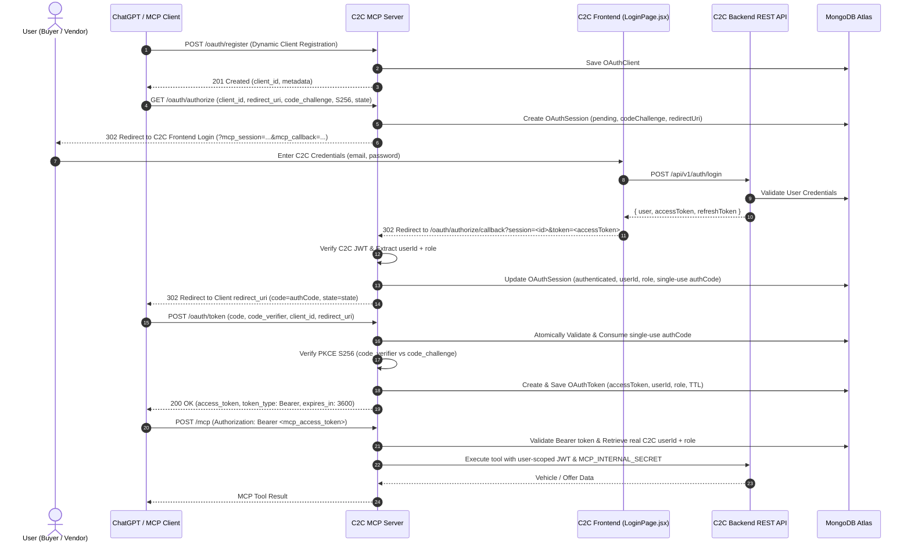

# 🚗 C2C Vehicle MCP Server

[](https://www.typescriptlang.org/)
[](https://modelcontextprotocol.io/)
[](https://nodejs.org/)
[](https://expressjs.com/)
[](https://opensource.org/licenses/ISC)

A production-ready **Model Context Protocol (MCP)** server for the **C2C (Customer-to-Customer) Vehicle Selling Platform**.

This server provides native AI agent integration with the C2C vehicle marketplace, featuring **Unified Authentication** (`C2C Website Login = MCP Login = Same User`), **MongoDB-backed OAuth 2.1 Authorization Code flow with PKCE (S256)**, and **Role-Enforced Marketplace Tools**.

---

## 📑 Table of Contents

- [Overview](#-overview)
- [Unified Authentication Architecture](#-unified-authentication-architecture)
- [OAuth 2.1 PKCE Flow](#-oauth-21-pkce-flow)
- [MCP Capabilities](#-mcp-capabilities)
  - [1. Marketplace & Offer Tools](#1-marketplace--offer-tools)
  - [2. Resources](#2-resources)
  - [3. Prompts](#3-prompts)
- [MongoDB Persistence Models](#-mongodb-persistence-models)
- [Project Structure](#-project-structure)
- [Environment Variables](#-environment-variables)
- [Getting Started](#-getting-started)
- [Client Integrations (ChatGPT, Claude, Custom)](#-client-integrations)
- [Security Features](#-security-features)

---

## 🌟 Overview

The **C2C Vehicle MCP Server** enables LLM clients (such as ChatGPT Custom GPTs, Claude Desktop, Cursor, and custom MCP clients) to securely interact with the C2C marketplace without manual JWT tokens or duplicate user accounts.

### Core Principles
- 🔑 **Single Identity:** The authenticated user in MCP is the exact same C2C user from the website database.
- 🛡 **Zero Static Tokens:** No hardcoded user JWTs in environment files. All identities are verified dynamically via OAuth 2.1 PKCE.
- 🗄 **Persistent State:** OAuth clients, sessions, single-use authorization codes, and Bearer tokens are persisted to MongoDB Atlas with TTL expiration.
- 🔒 **Role Enforcement:** Marketplace operations strictly enforce `buyer` vs `vendor` roles.
- ⚡ **Latest SDK v2:** Built using `@modelcontextprotocol/server` & `@modelcontextprotocol/express` v2.

---

## 🔐 Unified Authentication Architecture

```
                    ChatGPT / LLM Client
                             │
                             │ 1. /oauth/authorize (PKCE S256)
                             ▼
                    MCP Server (/oauth)
                             │
                             │ 2. Redirect to C2C Login
                             ▼
             C2C Frontend (LoginPage.jsx)
                             │
                             │ 3. Sign in with C2C credentials
                             ▼
                    C2C Backend API
                             │
                             │ 4. Issue C2C JWT
                             ▼
            MCP /oauth/authorize/callback
                             │
                             │ 5. Associate C2C userId & issue single-use code
                             ▼
                 ChatGPT OAuth Callback
                             │
                             │ 6. Exchange code + verifier (/oauth/token)
                             ▼
                   MCP Access Token
                             │
                             │ 7. Authenticated MCP calls (/mcp)
                             ▼
                   C2C MCP Tools
                             │
                             │ 8. Scoped execution with MCP_INTERNAL_SECRET
                             ▼
                    C2C Backend API
```

---

## 🔄 OAuth 2.1 PKCE Flow



---

## 🛠 MCP Capabilities

### 1. Marketplace & Offer Tools

| Tool Name | Role / Permission | Description |
| :--- | :---: | :--- |
| `search_vehicles` | **Public** | Search approved vehicle listings with multi-criteria filters (make, model, year, price, fuel, transmission, condition, geolocation radius, sort, pagination). |
| `get_vehicle_details` | **Public** | Retrieve complete technical specifications, inspection data, images, and seller details for a specific listing ID. |
| `offer_create` | **Buyer** | Submit a purchase offer with a monetary amount and optional note to the seller for an approved vehicle listing. |
| `offer_get` | **Authenticated** | Check the status (pending, accepted, rejected) and details of an offer by its ID. |
| `offer_mine` | **Buyer** | Retrieve all marketplace offers submitted by the authenticated buyer. |
| `offer_received` | **Vendor** | Retrieve all purchase offers received on the authenticated vendor's vehicle listings. |
| `offer_accept` | **Vendor** | Accept a buyer's offer on a vehicle listing. |
| `offer_reject` | **Vendor** | Reject a buyer's offer on a vehicle listing with an optional explanation note. |

### 2. Resources
- **URI:** `vehicle://V001`
- **MIME Type:** `application/json`
- **Description:** Structured JSON vehicle model for zero-shot grounding.

### 3. Prompts
- **`vehicle_price_analysis`**: Pre-configured prompt template evaluating vehicle fair market value based on age, fuel type, location, and condition.

---

## 🗄 MongoDB Persistence Models

1. **`OAuthClient` (`oauth_clients`)**:
   - `clientId`: Unique client identifier
   - `clientName`: Display name of client application
   - `redirectUris`: Whitelisted callback redirect URIs
   - `grantTypes`: `["authorization_code"]`
   - `responseTypes`: `["code"]`
   - `tokenEndpointAuthMethod`: `"none"` (public client PKCE)
   - `scope`: `"read write"`

2. **`OAuthSession` (`oauth_sessions`)**:
   - `sessionId`: Unique session tracking ID
   - `clientId`: Associated client
   - `redirectUri`: Verified redirect URI
   - `codeChallenge`: S256 PKCE code challenge
   - `userId`: Associated authentic C2C `User` ID
   - `userRole`: `"buyer"` | `"vendor"`
   - `status`: `"pending"` | `"authenticated"` | `"consumed"`
   - `authorizationCode`: Cryptographically secure single-use code
   - `expiresAt`: TTL index (15 min auto-cleanup)

3. **`OAuthToken` (`oauth_tokens`)**:
   - `accessToken`: Cryptographically secure Bearer token
   - `clientId`: Associated client
   - `userId`: Authentic C2C `User` ID
   - `role`: Role of the user (`buyer` / `vendor`)
   - `expiresAt`: TTL index (1 hour expiration)

---

## 📁 Project Structure

```
mcp-server/
├── .env                       # Environment configuration
├── package.json               # Dependencies and scripts
├── tsconfig.json              # TypeScript configuration
├── README.md                  # Documentation
└── src/
    ├── db.ts                  # MongoDB connection helper
    ├── server.ts              # MCP Server entry point & Express setup
    ├── client.ts              # Test MCP client
    ├── ai-client.ts           # OpenAI client integration example
    ├── models/
    │   ├── oauth-client.model.ts  # OAuth client model
    │   ├── oauth-session.model.ts # OAuth session & single-use auth code model
    │   └── oauth-token.model.ts   # OAuth Bearer token model
    ├── auth/
    │   ├── c2c-auth.service.ts    # User JWT generation & secure backend fetch
    │   ├── oauth.routes.ts        # OAuth 2.1 routes (/register, /authorize, /token)
    │   ├── oauth.service.ts       # MongoDB OAuth repository operations
    │   └── oauth.token.service.ts # PKCE S256 verifier & tokenVerifier
    ├── prompts/
    │   └── vehicle.prompts.ts     # MCP Prompts
    ├── resources/
    │   └── vehicle.resources.ts   # MCP Resources
    └── tools/
        └── vehicle.tools.ts       # Marketplace & Offer tools
```

---

## ⚙️ Environment Variables

Create or update `.env` in `mcp-server/`:

```env
# Server & Ports
PORT=3001
MCP_PUBLIC_URL=https://myth-ceremony-avenging.ngrok-free.dev

# C2C Integration
FRONTEND_URL=https://c2c-vehicle-selling-platform.vercel.app
C2C_API_BASE_URL=https://c2c-vehicle-selling-platform.onrender.com

# MongoDB
MONGO_URI=mongodb+srv://<username>:<password>@cluster0.jjmuzcq.mongodb.net/

# Secrets (Shared with C2C Backend)
JWT_ACCESS_SECRET=your_super_secret_access_key_change_this
JWT_ACCESS_EXPIRES=15m
MCP_INTERNAL_SECRET=ee5cd8ab0a0f751b4662a52cc5395c762d032fbea4c98d39bac802dca30956474f59e5f5c42afbd029b6ae4e8c6d320b96ebc2ae856bbef5a501ef9366c12a77
```

---

## 🚀 Getting Started

### 1. Install Dependencies
```bash
cd mcp-server
npm install
```

### 2. Start MCP Server
```bash
npm run dev
```

Server output:
```
Connected to MongoDB for MCP OAuth persistence.
C2C Vehicle MCP Server running on port 3001
MCP Endpoint: https://myth-ceremony-avenging.ngrok-free.dev/mcp
OAuth Authorize: https://myth-ceremony-avenging.ngrok-free.dev/oauth/authorize
```

---

## 🔌 Client Integrations

### ChatGPT Custom GPT Integration
In your Custom GPT Action configuration:
1. **Authentication Type:** `OAuth`
2. **Client ID:** Created via Dynamic Registration or MCP registration endpoint.
3. **Client Secret:** (Leave empty if public PKCE).
4. **Authorization URL:** `https://myth-ceremony-avenging.ngrok-free.dev/oauth/authorize`
5. **Token URL:** `https://myth-ceremony-avenging.ngrok-free.dev/oauth/token`
6. **Scope:** `read write`
7. **Token Exchange Method:** `Default (POST request)`

### Built-in Test Client
```bash
# Test public tools:
npx tsx src/client.ts

# Test authenticated tools:
MCP_ACCESS_TOKEN=<your_mcp_access_token> npx tsx src/client.ts
```

---

## 🛡 Security Features

- **OAuth 2.1 Conformance:** Only Authorization Code grant with mandatory PKCE (S256).
- **Single-Use Authorization Codes:** Auth codes are invalidated immediately upon consumption.
- **Private Shared Secret:** `MCP_INTERNAL_SECRET` is never sent to the frontend or exposed to LLMs.
- **Role Isolation:** Buyer cannot trigger vendor actions; vendor cannot trigger buyer actions.
- **No Passwords Stored in MCP:** Passwords remain strictly handled by the existing C2C backend authentication.

---

## 📜 License

ISC License.
