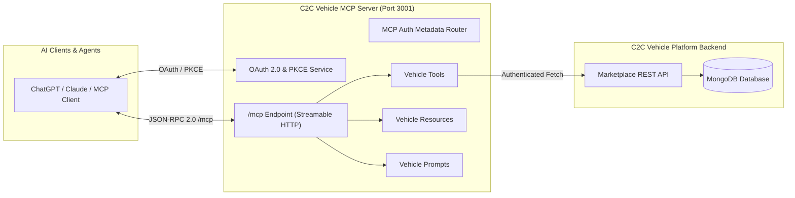
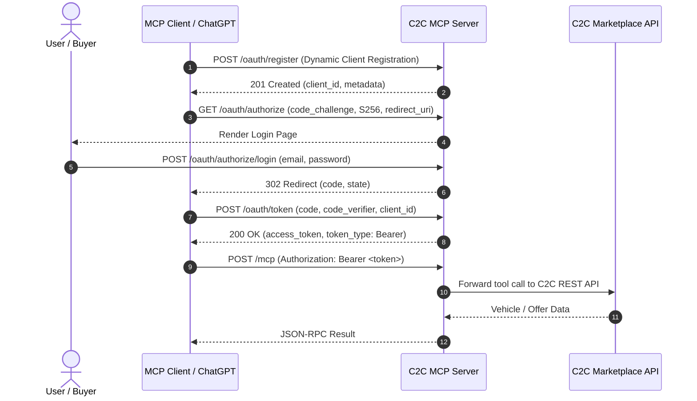

# 🚗 C2C Vehicle MCP Server

[](https://www.typescriptlang.org/)
[](https://modelcontextprotocol.io/)
[](https://nodejs.org/)
[](https://expressjs.com/)
[](https://opensource.org/licenses/ISC)

A production-ready **Model Context Protocol (MCP)** server for the **C2C (Customer-to-Customer) Vehicle Selling Platform**. This server enables Large Language Models (LLMs) and AI agents—such as Claude, ChatGPT, Cursor, and custom MCP clients—to interact directly with the vehicle marketplace to search listings, inspect vehicle details, submit buyer offers, inspect offer statuses, and analyze vehicle pricing in real time.

---

## 📑 Table of Contents

- [Overview](#-overview)
- [Architecture & Flow](#-architecture--flow)
- [MCP Capabilities](#-mcp-capabilities)
  - [Tools](#1-tools)
  - [Resources](#2-resources)
  - [Prompts](#3-prompts)
- [Authentication & OAuth 2.0 (PKCE)](#-authentication--oauth-20-pkce)
  - [OAuth Endpoints](#oauth-endpoints)
  - [Authentication Flow](#authentication-flow)
- [Project Structure](#-project-structure)
- [Environment Variables](#-environment-variables)
- [Installation & Quickstart](#-installation--quickstart)
- [Client Integration & Testing](#-client-integration--testing)
  - [1. Testing with the Built-in MCP Client](#1-testing-with-the-built-in-mcp-client)
  - [2. Testing with OpenAI / ChatGPT](#2-testing-with-openai--chatgpt)
  - [3. Connecting to Claude Desktop / Cursor](#3-connecting-to-claude-desktop--cursor)
- [API Reference for Tools](#-api-reference-for-tools)
- [Troubleshooting & FAQs](#-troubleshooting--faqs)

---

## 🌟 Overview

The **C2C Vehicle MCP Server** bridges autonomous AI agents with the backend REST API of the C2C Vehicle Selling Platform (`https://c2c-vehicle-selling-platform.onrender.com`). 

### Core Highlights
- 🔍 **Natural Language Vehicle Search:** Filter by make, model, price range, manufacturing year, fuel type, transmission, vehicle condition, and geospatial radius.
- 🤝 **End-to-End Buyer Offer Management:** Create purchase offers, check offer statuses, and track submitted buyer bids.
- 💡 **Marketplace Intelligence & Prompts:** Automated price analysis prompts to evaluate market fairness and deliver instant buying recommendations.
- 🔐 **Enterprise Auth & MCP Metadata Discovery:** Full OAuth 2.0 Authorization Server with RFC 7591 Dynamic Client Registration, PKCE (S256), and Bearer Token verification on `/mcp`.
- ⚡ **Streamable HTTP Transport:** Modern MCP HTTP-based transport compatible with remote agent workflows and reverse proxy tunnels (e.g., ngrok).

---

## 🏗 Architecture & Flow



---

## 🛠 MCP Capabilities

### 1. Tools

Tools enable LLMs to execute actions against the C2C vehicle marketplace:

| Tool Name | Description | Requires Auth |
| :--- | :--- | :---: |
| `search_vehicles` | Search approved marketplace listings with comprehensive filters (price, year, fuel, location, sort, pagination). | ❌ |
| `get_vehicle_details` | Retrieve complete technical specifications, photos, and seller information for a specific vehicle listing ID. | ❌ |
| `offer_create` | Submit a purchase offer with a monetary amount and optional note to the seller for a vehicle listing. | ✅ (`C2C_ACCESS_TOKEN`) |
| `offer_get` | Fetch current status (pending, accepted, rejected, countered) and details of an offer by its ID. | ✅ (`C2C_ACCESS_TOKEN`) |
| `offer_mine` | Retrieve the authenticated buyer's submitted offers with pagination support. | ✅ (`C2C_ACCESS_TOKEN`) |

### 2. Resources

Static and dynamic structured context provided to LLMs:

- **URI:** `vehicle://V001`
- **MIME Type:** `application/json`
- **Description:** Structured JSON representation of vehicle data for direct grounding and zero-shot reasoning without tool execution overhead.

### 3. Prompts

Pre-configured prompt templates for AI reasoning:

- **`vehicle_price_analysis`**:
  - **Argument:** `vehicleId` (string)
  - **Purpose:** Generates a structured prompt instructing the model to evaluate asking price against vehicle age, fuel type, geographic location, and overall market value to deliver a buying recommendation.

---

## 🔐 Authentication & OAuth 2.0 (PKCE)

The server features an integrated OAuth 2.0 Authorization Server conforming to the Model Context Protocol authorization specification:

### OAuth Endpoints

- **RFC 7591 Dynamic Client Registration:** `POST /oauth/register`
- **Authorization Endpoint:** `GET /oauth/authorize` (Renders the Web UI login form)
- **Login Submission:** `POST /oauth/authorize/login` (Validates user and issues authorization code)
- **Token Endpoint:** `POST /oauth/token` (Exchanges authorization code + PKCE `code_verifier` for Bearer access token)
- **Protected Resource Metadata:** `GET /.well-known/oauth-protected-resource`
- **Authorization Server Metadata:** `GET /.well-known/oauth-authorization-server` (via `@modelcontextprotocol/express`)

### Authentication Flow



---

## 📁 Project Structure

```
mcp-server/
├── .env                       # Environment variables (API keys, secrets, tokens)
├── package.json               # Dependencies and scripts
├── tsconfig.json              # TypeScript compiler configuration
└── src/
    ├── server.ts              # MCP Server entry point, Express app & OAuth router
    ├── client.ts              # Sample standalone MCP test client
    ├── ai-client.ts           # OpenAI SDK integration example
    ├── auth/
    │   ├── auth0.ts           # Optional Auth0 JWKS token verifier
    │   ├── c2c-auth.service.ts# Automatic token refresh & authenticated fetch wrapper
    │   ├── oauth.routes.ts    # OAuth 2.0 endpoints (register, authorize, token, UI)
    │   ├── oauth.service.ts   # In-memory client & authorization code store
    │   └── oauth.token.service.ts # Access token generation & PKCE S256 verifier
    ├── prompts/
    │   └── vehicle.prompts.ts # MCP Prompt templates (e.g., price analysis)
    ├── resources/
    │   └── vehicle.resources.ts # MCP Resource definitions (e.g., vehicle://V001)
    └── tools/
        └── vehicle.tools.ts   # MCP Tools (search, get details, offers)
```

---

## ⚙️ Environment Variables

Create a `.env` file in the `mcp-server/` root directory:

```env
# ============================================================
# Server & OAuth Configuration
# ============================================================
PORT=3001
MCP_INTERNAL_SECRET=your_long_random_hex_secret

# ============================================================
# C2C Vehicle Marketplace Integration
# ============================================================
# JWT Access token for authorized buyer operations (creating/viewing offers)
C2C_ACCESS_TOKEN=eyJhbGciOiJIUzI1NiIsInR5cCI6IkpXVCJ9...
C2C_REFRESH_TOKEN=your_c2c_refresh_token

# ============================================================
# AI & External Provider Keys (Optional for client scripts)
# ============================================================
OPENAI_API_KEY=sk-proj-...
AUTH0_ISSUER=https://your-tenant.auth0.com/
AUTH0_AUDIENCE=https://c2c-vehicle-mcp-api
```

### Environment Variable Reference

| Variable | Required | Description |
| :--- | :---: | :--- |
| `C2C_ACCESS_TOKEN` | **Yes** (for offers) | Bearer JWT used by the MCP server to authenticate buyer requests with the marketplace API. |
| `C2C_REFRESH_TOKEN` | Optional | Refresh token used by `c2c-auth.service.ts` to automatically refresh expired access tokens. |
| `MCP_INTERNAL_SECRET` | Recommended | Secret key used for internal token signing and authorization routines. |
| `OPENAI_API_KEY` | Optional | Needed if testing with `src/ai-client.ts`. |
| `AUTH0_ISSUER` / `AUTH0_AUDIENCE` | Optional | Used if switching from built-in OAuth to Auth0 JWT verification. |

---

## 🚀 Installation & Quickstart

### 1. Prerequisites
- **Node.js** v18.0.0 or higher
- **npm** v9.0.0 or higher

### 2. Install Dependencies
```bash
cd mcp-server
npm install
```

### 3. Start the Development Server
```bash
npm run dev
```

The server will start on port `3001`:
```
C2C Vehicle MCP Server running on port 3001
```

---

## 🧪 Client Integration & Testing

### 1. Testing with the Built-in MCP Client

The repository includes a pre-configured MCP client script (`src/client.ts`) that connects over HTTP transport:

```bash
npx tsx src/client.ts
```

**Expected output:**
```
Connected to C2C MCP Server

Available tools:
- search_vehicles: Search approved vehicles available on the C2C vehicle marketplace.
- get_vehicle_details: Get complete details of a specific approved vehicle listing using its listing ID.
- offer_create: Create a purchase offer for a vehicle listing on the C2C marketplace.
- offer_get: Get the details and current status of a vehicle offer from the C2C marketplace.
- offer_mine: Get the authenticated buyer's vehicle offers from the C2C marketplace.

Tool result:
{
  content: [ { type: 'text', text: '{\n  "status": "success",\n  "data": [ ... ]\n}' } ]
}
```

---

### 2. Testing with OpenAI / ChatGPT

Run the sample script in `src/ai-client.ts`:

```bash
npx tsx src/ai-client.ts
```

---

### 3. Connecting to Claude Desktop / Cursor

To connect Claude Desktop or an MCP-compatible IDE to your server, add the server to your MCP configuration:

#### Remote / HTTP Transport:
```json
{
  "mcpServers": {
    "c2c-vehicle": {
      "url": "http://localhost:3001/mcp",
      "headers": {
        "Authorization": "Bearer <YOUR_GENERATED_OR_TEST_ACCESS_TOKEN>"
      }
    }
  }
}
```

> **Note:** If exposing the server for remote clients (e.g. OpenAI Action / Custom GPTs / Claude remote), use a tunnel like [ngrok](https://ngrok.com/):
> ```bash
> ngrok http 3001
> ```
> Update `allowedHosts` and OAuth issuer URLs in `src/server.ts` to match your ngrok domain.

---

## 📖 API Reference for Tools

### `search_vehicles`
Search marketplace inventory with flexible parameters.

```json
{
  "search": "Fortuner",
  "minYear": 2020,
  "maxYear": 2024,
  "minPrice": 1000000,
  "maxPrice": 3500000,
  "fuelType": "diesel",
  "transmission": "automatic",
  "condition": "used",
  "latitude": 17.3850,
  "longitude": 78.4867,
  "radius": 50,
  "sort": "price_asc",
  "page": 1,
  "limit": 10
}
```

### `get_vehicle_details`
Retrieve complete details of a vehicle.

```json
{
  "listingId": "664e52f59a0ac30aeeffae12"
}
```

### `offer_create`
Submit a formal offer to purchase a vehicle.

```json
{
  "listingId": "664e52f59a0ac30aeeffae12",
  "amount": 1850000,
  "message": "I am interested in inspecting the vehicle tomorrow and making payment immediately."
}
```

### `offer_get`
Check status of an existing offer.

```json
{
  "id": "664e53b29a0ac30aeeffae99"
}
```

### `offer_mine`
List all offers placed by the authenticated buyer.

```json
{
  "page": 1,
  "limit": 20
}
```

---

## ❓ Troubleshooting & FAQs

#### Q: Getting `401 Unauthorized - Missing Authorization header` on `/mcp`?
**A:** The `/mcp` endpoint is protected by Bearer authentication. Ensure your MCP client provides a valid Bearer token in the `Authorization` header, or complete the OAuth PKCE flow via `/oauth/authorize`.

#### Q: Getting `C2C_ACCESS_TOKEN is not configured in the MCP server environment`?
**A:** Ensure your `.env` file contains a valid `C2C_ACCESS_TOKEN` for interacting with buyer-specific endpoints (`offer_create`, `offer_get`, `offer_mine`).

#### Q: How to add new marketplace tools?
**A:** 
1. Open `src/tools/vehicle.tools.ts`.
2. Call `server.registerTool(...)` with Zod input schema validation.
3. Implement the REST endpoint call and return the standardized `{ content: [{ type: "text", text: ... }] }` response.

---

## 📜 License

This project is licensed under the **ISC License**.
